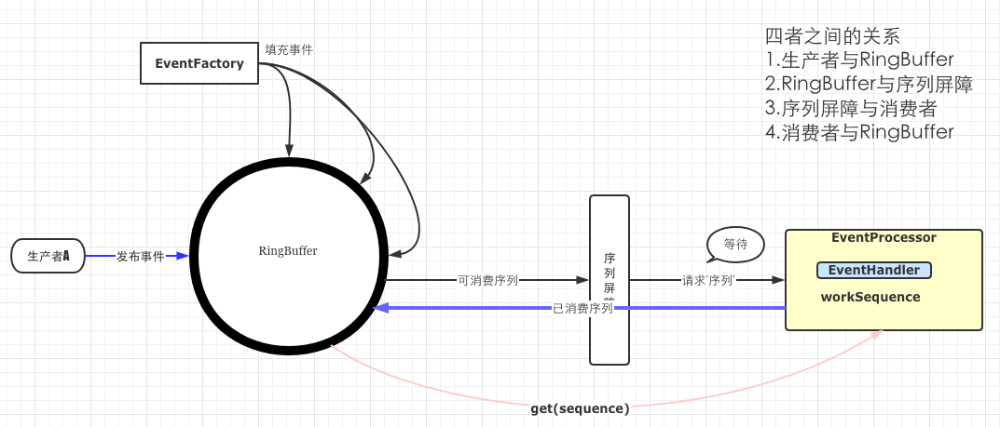
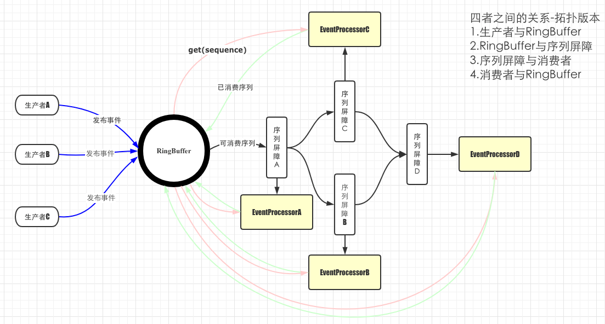

# 1.编程API

## 1.1 RingBuffer的基本用法
1.  RingBuffer用法架构图-基本版



2.  演示代码[RingBuffer基本用法](../java/base/RingBufferTest.java)
    1.  构建RingBuffer：
        1.  以RingBuffer构造一个Sequencer
        2.  申请RingBuffer数据并填充事件
        ```
        RingBufferFields(
            EventFactory<E> eventFactory,
            Sequencer sequencer)
        {
            ...
            this.entries = new Object[sequencer.getBufferSize() + 2 * BUFFER_PAD];
            fill(eventFactory);
        }
        ```
    2.  构造EventProcessor：每一个EventProcessor都


2.  RingBuffer已经被Disruptor包装了，所以，从使用的角度来看，可以不用学习了。

## 1.2 Disruptor的基本用法

1.  再看一张比较全面的RingBuffer工作流程图



2.  [看一下基本用法代码](../java/base/DisruptorUsageTest.java)
```
//      1.  构造disruptor：提供事件Factory，buffer_size，ThreadFactory，ProducerType，WaitStrategy
        Disruptor<LongEvent> disruptor =
                new Disruptor<LongEvent>(
                        LongEvent::new,
                        BUFFER_SIZE,
                        new DisruptorUsageThreadFactory(),
                        ProducerType.SINGLE,
                        new YieldingWaitStrategy());

//      2. 链接事件处理
        LongEventHandler1 handler1 = new LongEventHandler1();
        disruptor.handleEventsWith(handler1);
//      3. 启动disruptor
        disruptor.start();
//      4. 发布事件
        LongEventProducerWithTranslator producer = new LongEventProducerWithTranslator(disruptor.getRingBuffer());
        try {
            producer.productEvent(10);
        } catch (InterruptedException e) {
            e.printStackTrace();
        }
//      5. 关闭
        disruptor.shutdown();
```


## 1.3 事件处理
1.  事件处理流程：EventHandler会被包装成一个BatchEventProcessor，该Processor按照自己的sequence(按照自然数序列)逐个
    向SequenceBarrier请求可用的sequence，请求可能需要等待，直到请求到返回；请求到之后，回调'事件处理函数'onEvent.
    然后设置自己的sequence。
2.  代码演示：
3.  实现代码分析：BatchEventProcessor的run方法是调用processEvents()实现的
    ```text
    private void processEvents()
    {   //很重要的一个方法
        T event = null;
        long nextSequence = sequence.get() + 1L; //获取下一个序列——BatchEventProcessor固有的节奏

        while (true)
        {
            try
            {   //请求下一个可用序列，可能会被阻塞；这也是一个很重要的方法，后面讲等待策略中再详细解释。
                final long availableSequence = sequenceBarrier.waitFor(nextSequence);
                if (batchStartAware != null)
                {   //实现BatchStartAware的Handler的回调处
                    batchStartAware.onBatchStart(availableSequence - nextSequence + 1);
                }

                while (nextSequence <= availableSequence)
                {   //去RingBuffer取指定Sequence的事件Event
                    event = dataProvider.get(nextSequence);
                    //回调事件处理函数
                    eventHandler.onEvent(event, nextSequence, nextSequence == availableSequence);
                    nextSequence++;
                }
                // 释放当前的Sequence，会被后继的SequenceBarrier看到
                sequence.set(availableSequence);
            }
            
        }
    }
    ```
## 1.4 广播消费：
1.  广播消费：当多个handler都对订阅了某个事件后，该事件流就会以广播的形式被多是EventHandler分别消费。
    其实现原理也很简单：
    1.  多个EventProcessor的具有相同的SequenceBarrier，即具有相同的依赖序列'dependencySequences'——结合等待策略的waitFor函数看.
    2.  每个EventProcessor有自己的Sequence.

2.  代码演示：

3.  代码实现分析：
    ```
    //只需要看一下创建EventProcessor的参数就好了
    EventHandlerGroup<T> createEventProcessors(
        final Sequence[] barrierSequences,
        final EventHandler<? super T>[] eventHandlers)
    {
        final Sequence[] processorSequences = new Sequence[eventHandlers.length];
        final SequenceBarrier barrier = ringBuffer.newBarrier(barrierSequences);

        for (int i = 0, eventHandlersLength = eventHandlers.length; i < eventHandlersLength; i++)
        {
            final EventHandler<? super T> eventHandler = eventHandlers[i];
            // 1.有共同的SequenceBarrier，即有共同的依赖序列
            final BatchEventProcessor<T> batchEventProcessor =
                new BatchEventProcessor<>(ringBuffer, barrier, eventHandler);
            // 2.BatchEventProcessor中又有各自的Sequence，下文会有BatchEventProcessor字段说明。
            ...
        }
        
        return new EventHandlerGroup<>(this, consumerRepository, processorSequences);
    }

    ```


## 1.5 多线程消费
1.  当预估了事件流量比较大时，就需要开启Handler的多线程模式。ps：我还没有找的线程池模式。
    其实现思路是：同一个Handler的多个对象对可消费序列进行cas式请求，请求成功后执行事件处理函数，请求失败的则继续cas请求
    ps：这是jdk的队列没有提供的一种功能，当然，我们也可以自造轮子。
2.  代码演示
3.  实现分析：多个Handler共用一个workSequence，并且cas后取下一个workSequence，然后waitFor(workSequence)
    ```
    public void run()
    {       //WorkProcessor.java
        
                ...
                if (processedSequence)
                {
                    processedSequence = false;
                    do{     //"cas+循环" 获取下一个可用的workSequence.
                        nextSequence = workSequence.get() + 1L;
                        sequence.set(nextSequence - 1L);
                    }
                    while (!workSequence.compareAndSet(nextSequence - 1L, nextSequence));
                }

                if (cachedAvailableSequence >= nextSequence){
                //  nextSequence已经可以处理
                    event = ringBuffer.get(nextSequence);
                    workHandler.onEvent(event);
                    processedSequence = true;
                } else { //等一会前驱
                    cachedAvailableSequence = sequenceBarrier.waitFor(nextSequence);
                }
            }
            ...
    }
    ```

## 1.6 阻塞生产者
1.  当生产者快于最后一个消费者一圈的时候，生产者再去请求下一个可用的序列时nextSequence，就会阻塞。
2.  代码演示  
3.  实现分析：当下一个sequence-bufferSize还大于最小的消费过的序列时，就park请求线程
    ```
    public long next(int n)
    {
       
        long nextValue = this.nextValue;

        long nextSequence = nextValue + n;
        long wrapPoint = nextSequence - bufferSize; //减去了一圈
        long cachedGatingSequence = this.cachedValue;

        if (wrapPoint > cachedGatingSequence || cachedGatingSequence > nextValue)
        {
            cursor.setVolatile(nextValue);  // StoreLoad fence
              
            long minSequence;
            while (wrapPoint > (minSequence = Util.getMinimumSequence(gatingSequences, nextValue))){
            //  当下一个可用的point大于最小的消费过的序列时，就park
                LockSupport.parkNanos(1L); // TODO: Use waitStrategy to spin?
            }
            this.cachedValue = minSequence;
        }
        this.nextValue = nextSequence;

        return nextSequence;
    }
    ```

1.7 消费拓扑
1.  用disruptor可以很方便的创建拓扑结构的消费流。
2.  代码演示：
    ```text
    //构建拓扑-两个串行的菱形
    appendEventDisruptor
            .handleEventsWith(new AppendEventHandler1(), new AppendEventHandler2())
            .handleEventsWith(new AppendEventHandler3())
            .handleEventsWith(new AppendEventHandler4(), new AppendEventHandler5())
            .handleEventsWith(new AppendEventHandler6());

    ```
3.  实现思路：
    1.  SequenceBarrier封装了依赖序列，EventProcessor封装了Sequence和SequenceBarrier，两者相互嵌套，就可以实现线性依赖链了。
    2.  多个EventProcessor共享SequenceBarrier就可以实现广播消费。
    3.  结合'广播消费'和'线性依赖'就能构件任意的有向无环图拓扑。
    4.  具体实现代码可见createEventProcessors()，其中会创建SequenceBarrier和EventProcessor。

# 2.原理分析和代码解读

## 2.1 工作方式分析

### 1. EventProcessor：事件处理器

1. 每一个Handler都会被包装成一个EventProcessor。
2. 重要成员变量
    ```
    private final DataProvider<T> dataProvider;	//ringBuffer
    private final SequenceBarrier sequenceBarrier;	 //依赖-前驱
    private final EventHandler<? super T> eventHandler; //用户定义的事件处理函数
    private final Sequence sequence; //该Processor的序列，会被后继SequenceBarrier依赖
    private final BatchStartAware batchStartAware; //批处理接口
    
    ```
3. EventProcessor的工作方式：

   1. 首先要了解到，它实现了Runnable接口，它运行在独立的线程中的。

   2. 它的最直接的使命就是消费下一个Sequence位置的事件，消费逻辑变是用户定义的EventHandler的onEvent函数，然后更新sequence。
      ps：Sequence是一个连续自然数

   3. 但是它一般会等待在strategy.waitFor(sequence)上，等待可用的序列。


### 2. Sequence：传递数据vs传递数据位置

1.  与BlockQueue的传递数据不同，Disruptor不传递数据，传递数据的位置（sequence就是数据位置），接收者去指定的sequence处取出数据并消费。
2.	sequence必须是并发安全的。

### 3. SequenceBarrier：构建偏序关系

1. 以ProcessingSequenceBarrier为例，其重要的成员变量。

    ```
    WaitStrategy waitStrategy;		//等待策略：根据依赖Sequence和cursorSequence计算当期可消费的availableSequence
    Sequence dependentSequence; 	//依赖的Sequence，可以是多个Sequence[]
    Sequence cursorSequence;		//当前的Sequence，也叫游标，其实是RingBuffer的sequence
    ```

2.  首先在数据层面，可以粗略的将'内存屏障'看做是依赖序列的集合。其次，结合具体的等待策略和cursorSequence，具体控制了依赖该屏障的EventProcessor的等待行为。
3.  SequenceBarrier结合EventProcessor的workSequence是如何构造拓扑图的？见1.7消费拓扑的实现思路


 4. SequenceBarrier的waitFor函数：

    ```
    long availableSequence = waitStrategy.waitFor(sequence, cursorSequence, dependentSequence, this);
    if (availableSequence < sequence){
      //可用序列小于请求队列时，直接返回可用序列
      return availableSequence;
    }
    return sequencer.getHighestPublishedSequence(sequence, availableSequence);//返回availableSequence.
    ```

    

### 4.WaitStrategy：等待策略

 1. 被SequenceBarrier使用，定义(狭义感性认识)当无事件消费时EventProcessor应该如何行为。

 2. 已知的几个等待策略如下：

    1. BlockingWaitStrategy：效率低下，不适合用于高吞吐量；但是在低吞吐量时，对cpu友好

       ```
       //加锁
       while (cursorSequence.get() < sequence){
         barrier.checkAlert();
         processorNotifyCondition.await();
       }
       //解锁
       ```

    2. BusySpinWaitStrategy ：效率高，适合高吞吐量；地吞吐量时，造成cpu资源浪费

       ```
       while ((availableSequence = dependentSequence.get()) < sequence){ //当可用的sequence小于请求的sequence时
         ThreadHints.onSpinWait(); //自旋-jdk中实现的一个方法
       }
       ```

    3. YieldingWaitStrategy：比BusySpinWaitStrategy更节约cpu

       ```
       while ((availableSequence = dependentSequence.get()) < sequence){ //当可用的sequence小于请求的sequence时
       	counter = applyWaitMethod(barrier, counter); //累积到一定的count后Thread.yield().
       }
       ```

## 2.2 高性能分析

### 1.伪共享和缓存行填充

1. [剖析Disruptor:为什么会这么快？（二）神奇的缓存行填充]: http://ifeve.com/disruptor-cacheline-padding

2. [剖析Disruptor:为什么会这么快？(三)揭秘内存屏障]: http://ifeve.com/disruptor-memory-barrier/

    

### 2.无锁设计

1. [The Disruptor – Lock-free publishing]: http://blog.codeaholics.org/2011/the-disruptor-lock-free-publishing/

   
## 2.3 具体问题分析

1. 如何保证生产者不覆盖尚未消费的事件？
   1. 在获取下一个序列时，next就会计算所有的sequence的最小值是否小于当前cursor-buffer_size。如果小的话，就阻塞了。
2. 如何触发后继结点呢？
   1. 当前handler处理完event时，只需要增加当前结点的sequence就可以了。
   2. 后继结点是等待在sequence的。
3. 如何实现WorkPool
   1. 多个handler共同cas方式争夺同一个sequence
4. BatchEventProcessor如何实现批量操作
   1. 所谓批量操作，就是发现当前可处理的curSequence-requestSequenced = batchSize > 1时，for循环调用handler.onEvent()而已。
   2. 由于批量操作，导致我们最初观察到一个’阻塞‘现象，为了解开这个谜团，我们才入坑Disruptor源码的。
   3. '阻塞'假象：在线性拓扑中，比如h1->h2->h3，对于事件流e1、e2、e3，，，dn，h1每处理完一个时间e1，h2就可以紧接着处理e1，然后是h3；而不用等到h1处理完dn之后，h2才开始处理e1、e2、e3，，，dn——这是完全是阻塞的表现
   4. 解密阻塞假象：因为生产事件是非常快的，所以h1一下子进行了批处理，导致了（e1、e2、e3，，，dn）同步在一个批处理中完成，而后才设置Sequence，所以h2是一下子看到了这n个事件，然后继续批处理，然后把这一批在一块给h3.
   5. 验证：
      1. 让生产者生产大量的事件，比如10w，然后对比第一个事件的处理流和第10w个事件的处理流
      2. 让生产者循环生产事件的时候，进行睡眠一会会，以降低批处理的batchSize，从而就不会整体’阻塞‘了。
      3. 让事件消费这实现BatchStartAware接口，从而感知到批处理的存在。

# 3.扩展和讨论

1. 为什么要用内存队列
2. Disruptor与BlockQueue有什么功能优势

   1. 优点：不用传递数据
   2. 优点：支持广播
   3. 缺点：？

3. 面向执行流编程 Vs 面向事件流的编程
   1. 订单确认事件：
      1. 内部系统：履约rpc、库存下单
      2. 外部下游系统：发送RabbitMQ等
   2. UserBuyRecordMsg保存事件
      1. save/update
      2. 加班
      3. 发送短信消息
      4. 积分
      5. 月课送体验营
      6. 孪生专辑
      7. 履约消息   

4.  有界队列抑制生产效率时怎么办
​	1.	这说明系统的处理能力不行，需要拆分业务出去，或者使用更强大的机器

5.  如何在SpringBoot中使用Disruptor呢，或者如何实现面向事件编程呢?


# 4. 扩展阅读：

   1.   [[老李读disruptor源码](https://www.jianshu.com/nb/16218289)]

   2.   [[Mechanical Sympathy](https://mechanical-sympathy.blogspot.com/])]
   
   3.   [disruptor工作结构图](https://www.processon.com/diagraming/5f028f3e6376891e81fd56b7)
   
   4.   [领域驱动设计(DDD) 领域事件](https://zhuanlan.zhihu.com/p/41115251)
   5.   [到底什么是事件驱动架构EDA](https://www.jdon.com/49113)